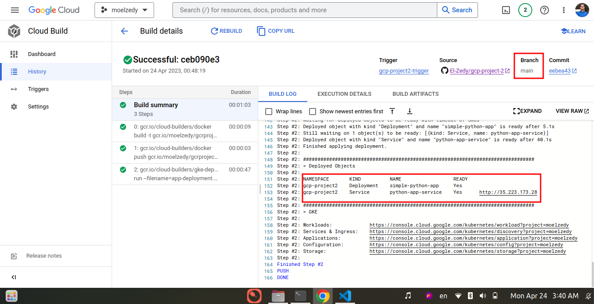

# DevOps lifecycle in GCP :cloud:

- Containerize a simple application written in python
- Using `Cloud Build` as a Serverless CI/CD Platform to automate our cycle
- Using `Build Triggers` to run our CI/CD when main and dev branches have been modified
- Using `Artifact Registry` to manage application container image
- Deployment will be on `GKE`
- Apply DevOps best practices by setting up a development environment

## Prerequisites:
- Linux
- Docker
- Kubernetes
- CI/CD
- Github

## Getting Started:
- Create Dockerfile for our project and test a container from it locally to make sure that we are on the right way
- Pushing our code to the GitHub repo and create `dev branch` as our development environment

- Set up a GKE cluster with two namespaces one for prod and another for dev
- Creating a deployment and service file for our application
- Set up our Triggers one for the main branch which is a production env and the dev beanch as a development env

- Write our `cloudbuild.yml` files which be triggered when any change happened at our two environments
- development environment trigger

- Production environment trigger

- Validating our work by accessing our loadblancer endpoint to check that everything works as excepected.
- Finally our project works well and available for users! :tada::tada:

## Contributing
Contributions to this project are welcome and appreciated. To contribute, please follow these steps:
1. Fork the repository to your own account.
2. Create a new branch for your changes.
3. Make your changes and commit them to your branch.
4. Create a pull request to merge your changes into the main branch.
# Conclusion
In conclusion, this repository serves as a demonstration of how to create an automated CI/CD using cloud build and GKE on GCP. By following the instructions in this repository, you can learn how to : 
- Containerize a simple application written in python
- Using `Cloud Build` as a Serverless CI/CD Platform to automate our cycle
- Using `Build Triggers` to run our CI/CD when Main and Dev branches have modified
- Using `Artifact Registry` to manage application container image
- Deployment will be on `GKE`
- Apply DevOps best practices by setting up a development environment
## Acknowledgements
We would like to acknowledge the following individuals and resources for their contributions to this project:

- Our instructor Raghunandana Sanur, for providing guidance and support throughout the project.
- The Google Cloud Platform documentation, which served as a valuable resource for understanding the various GCP services and how they can be used together.
## Contact
If you have any questions or suggestions regarding this project, please contact the project owner at muhammadhassanelzedy@gmail.com .
